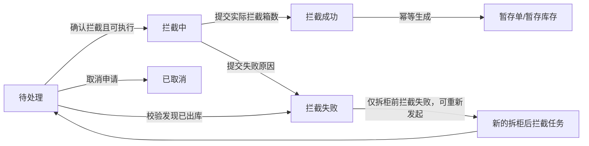

# 拦截管理 PRD

## 1. 文档信息

| 项目 | 内容 |
| --- | --- |
| 产品名称 | 美仓海外仓系统：拦截管理 |
| 文档版本 | V1.0 |
| 文档状态 | 产品方案与研发测试基线 |
| 编写日期 | 2026-08-12 |
| 原型基线 | 本地拦截管理页面 `http://127.0.0.1:8086/` |
| 适用端 | 海外仓管理后台（Web） |
| 目标读者 | 产品、研发、测试、客服、仓库运营、财务、实施 |

> 本文以当前交互原型为主要基线，并补充生产化所需的权限、接口、幂等、异常处理和验收要求。当前原型使用前端演示数据；真实任务、文件、费用核销、导出及暂存单生成须接入后端服务。

## 2. 修订记录

| 版本 | 日期 | 修订人 | 修订内容 |
| --- | --- | --- | --- |
| V1.0 | 2026-08-12 | 产品 | 首版，覆盖拦截任务列表、状态流转、详情、费用、附件、日志、批量操作及暂存联动 |

## 3. 背景与问题

海外仓货物在到港、拆柜、入库及出库过程中，可能因客户调整运输计划、订单异常、资料问题或其他业务原因需要暂停原作业。拦截时点不同，实际执行路径和成功概率也不同：

- 未拆柜货物可在拆柜前发起预报拦截；
- 已拆柜、已入库货物需要仓库定位并执行拆柜后拦截；
- 已出库货物通常无法继续拦截，应快速反馈失败并留痕；
- 拦截过程中可能产生操作费用、附件和客户可见信息；
- 拦截成功的货物需要进入暂存库存，等待客户重新下单或后续处理。

当前业务需要一个统一工作台，解决以下问题：

1. 不同来源的拦截申请缺少统一查询和处理入口。
2. 客服、仓库和财务无法在同一任务上查看货物状态、处理进度和费用核销情况。
3. 单条和批量处理缺少一致的状态校验、失败反馈与操作留痕。
4. 拦截成功后生成暂存库存的链路容易出现重复生成或状态不一致。
5. 拆柜前拦截失败后，缺少受控的拆柜后重新发起机制。
6. 附件、客户备注、内部备注和操作日志缺少结构化管理。

## 4. 产品目标

### 4.1 业务目标

- 建立覆盖“申请进入—确认受理—仓库处理—成功/失败/取消”的拦截闭环。
- 统一接收“美仓拦截”和“天图拦截”等来源的任务。
- 支持拆柜前拦截与拆柜后拦截两类执行路径。
- 拦截成功后自动且幂等地生成暂存单，避免库存重复或遗漏。
- 让费用、核销、附件、备注和日志随任务完整沉淀。
- 提供筛选、批量处理、导出能力，提升仓库运营效率。

### 4.2 用户体验目标

- 用户进入版块后，可通过状态页签快速定位待办任务。
- 核心状态和关键异常应使用清晰的文本及颜色标识。
- 只有当前状态允许的操作才应展示或可用。
- 所有高风险状态变更必须有确认、必填校验和操作反馈。
- 批量操作应明确作用范围，并返回逐条处理结果。

### 4.3 建议衡量指标

| 指标 | 定义 | 建议目标 |
| --- | --- | --- |
| 首次受理时长 | 申请时间至确认拦截时间 | P90 ≤ 30 分钟 |
| 平均处理时长 | 确认拦截至成功/失败时间 | 按仓库和拦截类型统计 |
| 拦截成功率 | 拦截成功任务数 / 已完结任务数 | 按来源、类型、仓库监控 |
| 暂存单生成成功率 | 成功生成暂存单的拦截成功任务数 / 拦截成功任务数 | 100%（支持系统自动重试） |
| 重复暂存单率 | 同一拦截任务生成多张有效暂存单的比例 | 0% |
| 批量操作失败率 | 批量操作失败条数 / 批量提交条数 | 持续监控并可追踪原因 |

## 5. 范围

### 5.1 本期范围

- 拦截管理导航入口和主列表。
- 状态页签、组合筛选、重置和搜索。
- 单条与批量确认拦截、取消拦截、拦截成功、拦截失败。
- 拆柜前拦截失败后重新发起拆柜后拦截。
- 拦截详情、货箱信息、指令费用、附件和操作日志。
- 客户备注、内部备注的单条编辑及内部备注的批量追加。
- 已选任务 CSV 导出。
- 拦截成功后自动生成暂存单，并可跳转暂存库存查看。
- 未核销或部分核销费用的风险提醒。

### 5.2 依赖范围

- 客户、仓库、货物、入仓号和柜号等主数据。
- WMS/库存系统提供实时货物、拆柜和出库状态。
- 上游业务系统提供原始拦截申请及来源。
- 费用中心提供费用目录、汇率和核销状态。
- 文件服务提供附件上传、下载、权限控制和病毒扫描。
- 暂存库存服务提供暂存单创建与查询能力。
- 账号权限系统提供角色、仓库及客户数据范围。

### 5.3 非本期范围

- 在本版块创建首张原始拦截申请；原始申请由上游业务入口提交。
- 实际拆柜、找货、移库等 WMS 作业执行页面。
- 客户门户中的申请和消息通知页面。
- 财务核销工作台；本版块仅展示核销状态和风险提醒。
- 暂存单后续放货、审批、指令处理和出库流程。
- 承运商轨迹和 POD 的完整管理。

## 6. 用户角色与权限

### 6.1 角色定义

| 角色 | 核心职责 |
| --- | --- |
| 客服/跟单 | 查看申请进度、取消待处理申请、维护客户备注、查看结果与日志 |
| 仓库运营 | 确认受理、执行拦截、反馈成功/失败、维护费用/附件/内部备注 |
| 财务 | 查看指令费用与核销状态，处理核销风险 |
| 主管/管理员 | 查看全部数据、批量处理、异常干预、导出与审计 |
| 只读用户 | 查询列表、详情、附件和日志，不可修改业务数据 |

### 6.2 权限矩阵

| 能力 | 客服/跟单 | 仓库运营 | 财务 | 主管/管理员 | 只读 |
| --- | --- | --- | --- | --- | --- |
| 查询列表/详情/日志 | 是 | 是 | 是 | 是 | 是 |
| 取消待处理申请 | 是 | 按配置 | 否 | 是 | 否 |
| 确认拦截 | 否 | 是 | 否 | 是 | 否 |
| 提交拦截成功/失败 | 否 | 是 | 否 | 是 | 否 |
| 发起拆柜后拦截 | 是 | 按配置 | 否 | 是 | 否 |
| 编辑客户备注 | 是 | 按配置 | 否 | 是 | 否 |
| 编辑内部备注 | 按配置 | 是 | 否 | 是 | 否 |
| 维护指令费用 | 否 | 按配置 | 按配置 | 是 | 否 |
| 维护附件 | 按配置 | 是 | 按配置 | 是 | 否 |
| 导出 | 按配置 | 按配置 | 按配置 | 是 | 否 |

> 最终权限由权限中心配置并由后端接口校验。前端隐藏按钮不能替代接口鉴权。用户只能访问其被授权仓库和客户范围内的数据。

## 7. 核心业务定义

| 名称 | 定义 |
| --- | --- |
| 拦截任务 | 针对一个入仓号或指定货物发起的暂停原作业并尝试控制货物的业务任务 |
| 拦截单号 | 拦截任务的全局唯一编号 |
| 拆柜前拦截 | 货物尚未拆柜时发起的预报型拦截 |
| 拆柜后拦截 | 货物已拆柜或入库后，由仓库定位货物并执行的拦截 |
| 拦截来源 | 申请进入系统的渠道，当前包括“美仓拦截”“天图拦截” |
| 货物状态 | 货物在仓储链路中的实时状态，如未拆柜、已拆柜、已出库、暂存中 |
| 预报单状态 | 拦截预报任务的处理状态，如待预报、预报中、预报成功、预报失败、已取消 |
| 指令费用 | 因执行拦截产生的操作费用明细 |
| 核销状态 | 指令费用的财务确认状态，包括待核销、部分核销、已核销 |
| 暂存单 | 拦截成功后生成的库存凭证，货物进入暂存库存等待后续处理 |

## 8. 页面与信息架构

| 页面/区域 | 形式 | 主要用途 |
| --- | --- | --- |
| 拦截管理主列表 | 主页面 | 查询、筛选、选择、批量处理和进入详情 |
| 拦截详情 | 右侧抽屉 | 查看基础信息、流程、货箱、费用、附件并执行单条操作 |
| 指令费用 | 详情页签 + 弹窗 | 查看、新增、编辑、删除费用及实时计算金额 |
| 其它信息 | 详情页签 + 弹窗 | 上传、编辑、下载和删除附件 |
| 查看日志 | 弹窗 | 查看状态及数据变更历史 |
| 取消拦截 | 弹窗 | 填写取消原因并终止待处理任务 |
| 拦截结果反馈 | 弹窗 | 提交实际拦截箱数或失败原因 |
| 批量备注 | 弹窗 | 为已选任务追加相同内部备注 |
| 暂存库存 | 跨版块页面 | 查看拦截成功后生成的暂存单 |

## 9. 状态模型

### 9.1 拦截状态

| 状态 | 含义 | 进入条件 | 可执行核心操作 |
| --- | --- | --- | --- |
| 待处理 | 申请已进入系统，等待仓库确认 | 上游提交或拆柜后重新发起 | 确认拦截、取消申请、备注、导出 |
| 拦截中 | 仓库已接受任务并开始执行 | 待处理任务确认拦截且货物未出库 | 拦截成功、拦截失败、备注、导出 |
| 拦截成功 | 货物已被控制并转入暂存 | 拦截中任务提交成功结果 | 查看详情、查看暂存详情、备注、导出 |
| 拦截失败 | 货物无法完成拦截 | 已出库自动失败，或处理中反馈失败 | 查看原因；拆柜前失败可发起拆柜后拦截 |
| 已取消 | 申请在仓库受理前被撤回 | 待处理任务填写原因并取消 | 查看详情、日志、导出 |

### 9.2 状态流转图

### 9.3 状态流转规则

1. 只有“待处理”任务可确认或取消。
2. 只有“拦截中”任务可提交拦截成功或拦截失败。
3. 确认拦截时必须重新查询货物实时状态，不得仅依赖列表缓存。
4. 若确认时货物已出库，任务直接进入“拦截失败”，失败原因为“货物已完成出库”，并记录系统日志。
5. 拦截成功时，实际拦截箱数必须为整数，且范围为 1 至申请拦截箱数。
6. 拦截成功后，货物状态更新为“暂存中”，库存状态更新为“暂存”，出库状态保持“未出库”。
7. 拦截成功与暂存单生成必须支持幂等；同一拦截任务只能关联一张有效暂存单。
8. 拦截失败必须填写失败原因，可另填补充备注。
9. 已取消、拦截成功、拦截失败均视为当前任务的终态，不允许直接回退。
10. 拆柜前拦截失败可创建一张新的拆柜后拦截任务；原任务状态保持失败，两张任务通过 `retryOf` 关联。
11. 若原失败任务已存在“待处理”或“拦截中”的拆柜后重试任务，不得重复发起。
12. 新的拆柜后任务不继承原任务的指令费用，费用应按新任务重新录入；客户、货物和申请背景信息可继承。

### 9.4 预报单状态

当前原型按拦截状态映射预报单状态：

| 拦截状态 | 预报单状态 |
| --- | --- |
| 待处理 | 待预报 |
| 拦截中 | 预报中 |
| 拦截成功 | 预报成功 |
| 拦截失败 | 预报失败 |
| 已取消 | 已取消 |

生产系统若接入独立预报服务，应以后端返回的预报单状态为准，不再由前端推导；状态变化须保留同步日志。

## 10. 主列表需求

### 10.1 状态页签

按以下顺序展示：

1. 待处理
2. 处理中
3. 拦截成功
4. 拦截失败
5. 取消
6. 全部

规则：

- 页签显示状态名称和数量，格式如 `待处理(12)`。
- “处理中”对应数据状态“拦截中”，“取消”对应数据状态“已取消”。
- 默认进入“全部”页签。
- 切换页签后清空已选任务，保留筛选条件。
- 页签数量按当前用户的数据权限范围统计；当前原型不受筛选条件影响。
- 列表汇总显示筛选后的任务数，如“共 8 条拦截任务”。

### 10.2 筛选字段

筛选字段按以下顺序展示：

| 顺序 | 字段 | 控件 | 匹配规则 |
| --- | --- | --- | --- |
| 1 | 拦截单号 | 输入框 | 支持包含匹配，不区分英文大小写 |
| 2 | 入仓号 | 输入框 | 支持包含匹配，不区分英文大小写 |
| 3 | 柜号 | 输入框 | 支持包含匹配，不区分英文大小写 |
| 4 | 系统柜号 | 输入框 | 支持包含匹配，不区分英文大小写 |
| 5 | 客户名称 | 下拉单选 | 精确匹配，选项按权限范围数据去重 |
| 6 | 拦截类型 | 下拉单选 | 全部、拆柜前拦截、拆柜后拦截 |
| 7 | 拦截来源 | 下拉单选 | 全部、美仓拦截、天图拦截 |
| 8 | 货物状态 | 下拉单选 | 全部、未拆柜、已拆柜、已出库、暂存中 |
| 9 | 拦截状态 | 下拉单选 | 全部、待处理、处理中、拦截成功、拦截失败、已取消 |
| 10 | 预报单状态 | 下拉单选 | 全部、待预报、预报中、预报成功、预报失败、已取消 |
| 11 | 核销状态 | 下拉单选 | 全部、待核销、部分核销、已核销 |
| 12 | 申请时间 | 日期范围 | 起止日期均为包含边界 |

交互规则：

- 点击“搜索”按全部已填写条件进行 AND 组合查询。
- 输入框和下拉控件聚焦时按 Enter，等同点击“搜索”。
- 点击“重置”清空全部筛选条件、清空勾选，并切回“全部”页签。
- 开始日期晚于结束日期时，前端提示“开始日期不能晚于结束日期”，不发起查询。
- 生产环境使用服务端查询、排序和分页。

### 10.3 列表字段

| 顺序 | 字段 | 说明/展示规则 |
| --- | --- | --- |
| 1 | 选择框 | 支持单选和当前结果页全选 |
| 2 | 客户名称 | 客户主体名称 |
| 3 | 拦截类型 | 拆柜前拦截/拆柜后拦截 |
| 4 | 拦截单号 | 全局唯一，可复制；超长时省略并悬浮展示全文 |
| 5 | 入仓号 | 货物入仓业务编号 |
| 6 | 柜号 | 实际柜号，可为空 |
| 7 | 预报单状态 | 使用状态标签展示 |
| 8 | 拦截原因 | 申请人提交的原因，超长省略并悬浮展示全文 |
| 9 | 拦截箱数 | 未完成时显示申请箱数，成功后显示实际拦截箱数 |
| 10 | 指令费用 | 展示费用摘要，格式为“金额 币种 费用名称（单价/单位）” |
| 11 | 核销状态 | 待核销、部分核销、已核销，以状态标签展示 |
| 12 | 客户备注 | 面向客户或来源系统的备注 |
| 13 | 备注 | 内部处理备注 |
| 14 | 拦截来源 | 美仓拦截/天图拦截 |
| 15 | 申请人 | 发起申请的人员或系统 |
| 16 | 申请时间 | `YYYY-MM-DD HH:mm:ss` |
| 17 | 处理人 | 最近一次处理人，未处理显示“-” |
| 18 | 处理时间 | 最近一次处理时间，未处理显示“-” |
| 19 | 失败原因 | 仅“拦截失败”页签或明确筛选“拦截失败”时展示，支持悬浮查看全文 |
| 20 | 操作 | 详情、处理、日志、发起拆柜后拦截等动态操作 |

### 10.4 行内操作

| 操作 | 展示条件 | 结果 |
| --- | --- | --- |
| 详情 | 所有状态 | 以只读模式打开拦截详情 |
| 处理 | 待处理、拦截中 | 以处理模式打开详情并展示当前状态允许的动作 |
| 日志 | 所有状态 | 打开操作日志弹窗 |
| 发起拆柜后拦截 | 拆柜前拦截且状态为拦截失败 | 创建新的拆柜后拦截任务 |

### 10.5 分页

- 默认每页 50 条。
- 生产环境需支持 20、50、100 条/页，默认 50 条/页。
- 翻页后默认清空选择；如需跨页选择，必须明确展示已选总数并提供“清空选择”。
- 总条数和分页数据由后端返回。

## 11. 选择与批量操作

### 11.1 选择规则

- 表头选择框只控制当前结果页的可见任务。
- 部分选中时表头选择框展示半选状态。
- 切换状态页签、点击重置或批量操作成功后清空选择。
- 搜索后，不在结果集中的已选任务应自动移除。
- 无已选任务点击批量按钮时提示“请勾选运单”。

### 11.2 批量按钮可见性

| 当前页签 | 批量按钮 |
| --- | --- |
| 待处理 | 取消拦截、确认拦截、备注、导出 |
| 处理中 | 拦截成功、拦截失败、备注、导出 |
| 拦截成功/拦截失败/取消/全部 | 备注、导出；状态变更按钮按任务状态和权限控制 |

> 在“全部”页签中如选中不同状态的数据，后端必须逐条校验。产品建议仅对符合当前操作状态的数据开放状态变更按钮，避免混合状态批量提交。

### 11.3 批量确认拦截

- 仅处理状态为“待处理”的已选任务。
- 提交前检查费用核销状态；存在待核销或部分核销时进行二次提醒。
- 提交前重新校验货物实时状态。
- 若部分任务已出库，这些任务自动进入“拦截失败”，其余有效任务进入“拦截中”。
- 确认文案应展示总任务数及已出库任务数。
- 后端返回逐条结果，不得因单条失败回滚全部任务。

### 11.4 批量取消拦截

- 仅允许取消“待处理”任务。
- 取消原因必填，最多 200 字。
- 同一取消原因应用于全部已选任务。
- 每条任务分别生成取消日志。

### 11.5 批量拦截成功

- 仅允许处理状态为“拦截中”的已选任务。
- 当前原型默认以各任务申请箱数作为实际拦截箱数。
- 生产方案提交前应展示逐任务箱数，允许校正实际拦截箱数；每条均须满足 1 至申请箱数的校验。
- 可填写统一处理备注，最多 200 字。
- 每条成功任务分别生成暂存单及日志。
- 暂存单生成失败的任务不得被静默标记成功，须返回明确错误并支持重试。

### 11.6 批量拦截失败

- 仅允许处理状态为“拦截中”的已选任务。
- 失败原因必填，最多 200 字；补充备注选填，最多 200 字。
- 同一失败原因和备注应用于全部已选任务。
- 每条任务分别生成失败日志。

### 11.7 批量备注

- 备注内容必填，最多 200 字。
- 新备注追加到原内部备注之后，以中文分号分隔，不覆盖原备注。
- 每条任务生成“备注”操作日志。
- 操作完成后清空选择。

### 11.8 批量导出

- 仅导出当前可见结果中已勾选的任务。
- 无勾选时提示“请勾选运单”。
- 文件格式为 UTF-8 BOM 的 CSV，确保 Excel 打开中文不乱码。
- 文件名格式：`拦截管理_{当前页签}_{YYYY-MM-DD}.csv`。
- 导出字段顺序与列表业务字段保持一致，不包含选择框和操作列。
- 导出行为记录操作日志或审计事件，包含导出人、时间、筛选条件和任务数量。

## 12. 拦截详情

### 12.1 抽屉头部与进度

- 标题格式：`拦截详情 · {拦截单号}`。
- 副标题展示当前拦截状态及入仓号。
- 进度步骤为：提交申请 → 确认拦截 → 仓库处理中 → 完成/拦截失败/已取消。
- 已完成节点展示完成标记，当前节点突出显示。

### 12.2 基础信息

| 字段 | 说明 |
| --- | --- |
| 客户名称 | 任务所属客户 |
| 拦截来源 | 美仓拦截/天图拦截 |
| 拦截类型 | 拆柜前拦截/拆柜后拦截 |
| 拦截单号 | 当前任务唯一编号 |
| 入仓号 | 关联入仓业务编号 |
| 柜号 | 关联实际柜号 |
| 拦截原因 | 原申请原因 |
| 拦截箱数 | 申请箱数或成功后的实际箱数 |
| 货物状态 | 未拆柜、已拆柜、已出库、暂存中 |
| 所在仓库 | 当前所属仓库 |
| 出库状态 | 未出库/已出库等 |
| 申请人 | 申请提交人或系统 |
| 申请时间 | 申请提交时间 |
| 失败原因 | 仅拦截失败任务展示；必填，支持按权限编辑，修改后记录操作日志 |
| 客户备注 | 面向客户的备注，可按权限编辑 |
| 备注 | 内部备注，可按权限编辑 |

### 12.3 详情页签

详情包含以下页签，默认打开“货箱信息”：

1. 货箱信息
2. 指令费用
3. 其它信息

### 12.4 底部操作

| 当前状态/模式 | 操作 |
| --- | --- |
| 只读详情 | 关闭；拆柜前失败时可按权限发起拆柜后拦截 |
| 待处理（处理模式） | 取消申请、确认拦截 |
| 拦截中（处理模式） | 拦截失败、拦截成功 |
| 拦截成功（处理模式） | 查看暂存详情 |
| 其他终态 | 关闭 |

## 13. 货箱信息

### 13.1 字段

| 字段 | 说明 |
| --- | --- |
| 货箱号 | 系统箱号，按箱号升序展示 |
| 客户数据 | 客户侧箱号、SKU 或申报信息摘要 |
| 系统拣货（材重/实重） | 系统拣货结果及材积重/实重信息 |

### 13.2 规则

- 箱数应与任务申请箱数或实际拦截箱数一致。
- 拦截成功后以实际拦截箱数为准。
- 已出库或拦截失败任务仍可查看历史货箱信息，但不可在本版块修改。
- 货箱数据来自 WMS，详情加载失败时显示失败提示和“重试”，不得伪造空数据。

## 14. 指令费用

### 14.1 费用列表字段

| 字段 | 必填 | 规则 |
| --- | --- | --- |
| 计费时间 | 是 | 日期时间格式 |
| 费用名称 | 是 | 可从费用目录选择或按权限输入 |
| 费用类型 | 是 | 如操作费、仓储费、其他 |
| 计费单位 | 是 | 票、箱、KG、CBM 等 |
| 汇率 | 是 | 大于 0；人民币默认 1 |
| 单价 | 是 | 大于或等于 0，建议最多 4 位小数 |
| 数量 | 是 | 大于 0，建议最多 4 位小数 |
| 币种 | 是 | 人民币、USD；可配置扩展 |
| 原币应收金额 | 自动 | 单价 × 数量 |
| 人民币应收金额 | 自动 | 原币应收金额 × 汇率 |
| 费用备注 | 否 | 最多 200 字 |
| 添加时间 | 自动 | 首次创建时间 |
| 添加人 | 自动 | 首次创建人 |

### 14.2 费用操作

- 支持新增、编辑、删除费用明细。
- 点击“新增指令费用”打开费用编辑弹窗。
- 弹窗可一次新增或编辑多行费用。
- 金额在单价、数量、汇率变化时实时重算。
- 弹窗顶部实时展示费用条数、原币合计和人民币合计。
- 删除已有费用需二次确认；删除草稿行可直接移除。
- 保存时由后端再次计算金额，前端计算仅用于展示。
- 已核销费用原则上不可直接修改或删除；如业务允许，须走反核销或权限审批。

### 14.3 核销风险提醒

- 确认拦截前，若任一任务存在“待核销”或“部分核销”费用，提示：
  `所选运单包含未核销或部分核销的指令费用。是否仍要拦截？`
- 用户确认后可继续，取消则不改变任何任务状态。
- 是否允许继续应支持按客户或仓库策略配置；强管控场景可改为阻断。
- 核销状态必须以费用/财务服务返回为准，前端不可根据费用条数自行认定生产状态。

## 15. 附件管理

### 15.1 附件字段

| 字段 | 说明 |
| --- | --- |
| 附件名称 | 原文件名 |
| 附件类型 | POD、ISA、报关资料、底单、其他/其它、税金单、递延资料、提单 |
| 客户可见 | 可见/不可见 |
| 文件大小 | 使用 KB 或 MB 展示 |
| 上传人 | 当前操作人 |
| 上传时间 | 上传完成时间 |
| 操作 | 编辑、下载、删除 |

### 15.2 上传与编辑规则

- 文件必选，单文件大小不超过 50 MB。
- 文件类型必选，默认“其他”。
- 客户是否可见必选，默认“可见”；生产上线前需业务确认默认值是否应改为“不可见”。
- 报关件资料应选择“报关资料”。
- 服务端必须校验文件扩展名、MIME、大小并进行安全扫描。
- 上传未完成前不得提交业务记录。
- 编辑附件可修改附件类型和客户可见性；不重新选择文件时保留原文件。
- 删除附件必须二次确认并记录审计日志。
- 下载接口需校验当前用户权限和客户可见规则，使用短时效签名地址。
- 同名文件允许上传时，应由系统生成唯一存储键，展示名称保持原文件名。

## 16. 备注管理

### 16.1 客户备注

- 用于记录客户可理解、可对外同步的信息。
- 支持按权限单条编辑，最多 200 字。
- 修改时记录修改前后内容、操作人和时间。
- 客户是否实际可见由下游客户门户权限决定。

### 16.2 内部备注

- 用于仓库、客服和财务内部协作。
- 支持单条覆盖编辑和批量追加。
- 单条编辑最多 200 字；批量备注内容最多 200 字。
- 所有修改必须写入日志，敏感内容按数据权限控制。

## 17. 操作日志

### 17.1 展示字段

| 字段 | 说明 |
| --- | --- |
| 操作内容 | 提交申请、确认拦截、取消申请、拦截成功、拦截失败、备注等 |
| 操作前 | 操作前状态或字段值 |
| 操作后 | 操作后状态或字段值 |
| 操作人 | 人员账号、姓名或系统 |
| 操作时间 | 服务端时间，格式 `YYYY-MM-DD HH:mm:ss` |

### 17.2 日志规则

- 日志仅追加，不允许普通用户编辑或删除。
- 所有状态变化、备注变化、费用变化、附件变化、导出和暂存单生成均应记录审计事件。
- 日志使用服务端时间，统一按用户选择的时区展示。
- 系统自动操作的操作人显示“系统”，并记录触发原因。
- 批量操作应生成批次号，支持从单条日志追溯至批量请求。
- 日志至少保留 3 年，最终期限遵循公司审计和合规要求。

## 18. 单条处理流程

### 18.1 确认拦截

1. 用户在待处理任务点击“处理”。
2. 系统打开详情，展示货物、费用、附件和日志。
3. 用户点击“确认拦截”。
4. 系统检查操作权限、任务版本、费用核销风险和实时货物状态。
5. 未拆柜时提示“当前货物未拆柜，确认执行拦截？”；已入库时提示“当前货物已入库，确认执行拦截？”。
6. 用户确认后：
   - 可执行：状态变为“拦截中”；
   - 已出库：状态变为“拦截失败”，记录系统校验原因。
7. 页面刷新状态、处理人、处理时间和日志。

### 18.2 取消拦截

1. 待处理任务点击“取消申请”。
2. 弹窗要求填写取消原因，最多 200 字。
3. 提交成功后状态变为“已取消”。
4. 原内部备注后追加取消原因，并生成取消日志。

### 18.3 提交拦截成功

1. 拦截中任务点击“拦截成功”。
2. 填写实际拦截箱数，默认申请箱数；可填写 200 字以内备注。
3. 系统校验箱数在 1 至申请箱数之间。
4. 后端在同一业务事务或可靠事件链路中：
   - 将任务改为“拦截成功”；
   - 更新货物/库存状态；
   - 生成唯一暂存单；
   - 记录处理人、时间、结果和日志。
5. 返回暂存单号，并提供“查看暂存详情”。

### 18.4 提交拦截失败

1. 拦截中任务点击“拦截失败”。
2. 失败原因必填，最多 200 字；补充备注选填，最多 200 字。
3. 提交后任务进入“拦截失败”，保留货物当前真实状态。
4. 详情及日志展示失败原因、处理人和处理时间。

### 18.5 发起拆柜后拦截

1. 仅拆柜前拦截失败任务展示入口。
2. 系统先检查是否已有未完结的拆柜后重试任务。
3. 用户二次确认后创建新任务：
   - 新拦截单号唯一；
   - 类型为“拆柜后拦截”；
   - 状态为“待处理”；
   - 货物状态按实时 WMS 状态写入；
   - 关联原任务编号；
   - 不继承原指令费用；
   - 继承客户、入仓号、柜号、原因等背景信息。
4. 原任务和新任务分别记录互相关联的操作日志。
5. 页面切换至“待处理”并定位或提示新任务编号。

## 19. 拦截成功与暂存库存联动

### 19.1 暂存单数据

| 暂存字段 | 来源 |
| --- | --- |
| 暂存单号/托盘标签 | 暂存服务生成，建议格式 `STG{日期}{流水号}` |
| 客户名称 | 拦截任务客户 |
| 柜号 | 拦截任务柜号；为空时按业务规则回退入仓号 |
| 系统柜号 | 拦截任务系统柜号 |
| 入仓号 | 拦截任务入仓号 |
| 当前状态 | 暂存 |
| 目的地 | 暂存库 |
| 入库时间 | 拦截成功时间或实际移入暂存时间 |
| 总箱数 | 实际拦截箱数 |
| 未发货箱数 | 实际拦截箱数 |
| 已发货箱数 | 0 |
| 来源拦截单号 | 当前拦截任务编号，用于追溯 |

### 19.2 一致性要求

- 同一拦截任务重复提交成功，不得重复创建暂存单。
- 暂存单创建接口以拦截任务 ID 作为幂等键。
- 拦截任务保存 `storageNo`，暂存单保存 `sourceInterceptNo`，形成双向关联。
- 若使用异步消息，应采用可靠事件、失败重试和人工补偿队列。
- 在暂存单尚未成功创建时，页面不得展示虚假的可跳转单号。
- 已成功生成暂存单后，点击“查看暂存详情”跳转至暂存库存并定位该单。

## 20. 数据模型建议

### 20.1 拦截任务 `InterceptTask`

| 字段 | 类型 | 必填 | 说明 |
| --- | --- | --- | --- |
| id | string/long | 是 | 内部唯一 ID |
| interceptNo | string | 是 | 拦截单号，全局唯一 |
| interceptType | enum | 是 | BEFORE_UNPACK/AFTER_UNPACK |
| retryOf | string | 否 | 原失败拦截单号 |
| source | enum | 是 | MEICANG/TIANTU 等 |
| customerId/customerName | string | 是 | 客户信息 |
| warehouseId/warehouseName | string | 是 | 仓库信息 |
| inboundNo | string | 是 | 入仓号 |
| containerNo | string | 否 | 柜号 |
| systemContainerNo | string | 否 | 系统柜号 |
| status | enum | 是 | PENDING/PROCESSING/SUCCESS/FAILED/CANCELED |
| cargoStatus | enum | 是 | 实时货物状态快照 |
| inventoryStatus | enum | 否 | 库存状态快照 |
| outboundStatus | enum | 否 | 出库状态快照 |
| forecastStatus | enum | 否 | 预报单状态 |
| reconciliationStatus | enum | 否 | 核销状态 |
| requestedBoxes | integer | 是 | 申请拦截箱数 |
| actualBoxes | integer | 否 | 实际拦截箱数 |
| reason | string | 是 | 拦截原因 |
| customerRemark | string | 否 | 客户备注 |
| internalRemark | string | 否 | 内部备注 |
| failReason | string | 否 | 失败原因 |
| resultRemark | string | 否 | 处理结果备注 |
| applicantId/applicantName | string | 是 | 申请人 |
| appliedAt | datetime | 是 | 申请时间 |
| handlerId/handlerName | string | 否 | 最近处理人 |
| handledAt | datetime | 否 | 最近处理时间 |
| storageNo | string | 否 | 生成的暂存单号 |
| version | integer | 是 | 乐观锁版本号 |
| createdAt/updatedAt | datetime | 是 | 审计时间 |

### 20.2 指令费用 `InterceptFee`

包括：费用 ID、任务 ID、计费时间、费用目录 ID、费用名称、费用类型、单位、汇率、单价、数量、币种、原币金额、人民币金额、备注、核销状态、添加人、添加时间、版本号。

### 20.3 附件 `InterceptAttachment`

包括：附件 ID、任务 ID、存储键、原文件名、MIME、大小、附件类型、客户可见标识、扫描状态、上传人、上传时间、删除标识。

### 20.4 日志 `InterceptAuditLog`

包括：日志 ID、任务 ID、批次 ID、操作类型、操作前快照、操作后快照、备注、操作人、操作来源、操作时间、请求追踪 ID。

## 21. 接口建议

| 接口 | 方法 | 用途 |
| --- | --- | --- |
| `/api/intercepts` | GET | 分页查询任务 |
| `/api/intercepts/counts` | GET | 查询各状态页签数量 |
| `/api/intercepts/{id}` | GET | 查询任务详情 |
| `/api/intercepts/{id}/confirm` | POST | 确认拦截 |
| `/api/intercepts/{id}/cancel` | POST | 取消待处理任务 |
| `/api/intercepts/{id}/result` | POST | 提交成功/失败结果 |
| `/api/intercepts/{id}/retry-after-unpack` | POST | 创建拆柜后拦截任务 |
| `/api/intercepts/batch/confirm` | POST | 批量确认 |
| `/api/intercepts/batch/cancel` | POST | 批量取消 |
| `/api/intercepts/batch/result` | POST | 批量提交成功/失败 |
| `/api/intercepts/batch/remark` | POST | 批量追加备注 |
| `/api/intercepts/export` | POST | 异步或同步导出已选任务 |
| `/api/intercepts/{id}/fees` | GET/POST | 查询或新增费用 |
| `/api/intercepts/{id}/fees/{feeId}` | PUT/DELETE | 编辑或删除费用 |
| `/api/intercepts/{id}/attachments` | GET/POST | 查询或上传附件 |
| `/api/intercepts/{id}/attachments/{attachmentId}` | PUT/DELETE | 编辑元数据或删除附件 |
| `/api/intercepts/{id}/logs` | GET | 分页查询操作日志 |

接口通用要求：

- 状态变更请求携带 `version` 或 ETag，防止并发覆盖。
- 写接口携带幂等键 `Idempotency-Key`。
- 批量接口逐条返回任务 ID、结果、最新状态和失败原因。
- 后端不能信任前端传入的处理人、金额和权限范围。
- 所有时间由服务端生成并以 UTC 存储，前端按所选时区展示。

## 22. 异常与边界处理

| 场景 | 处理要求 |
| --- | --- |
| 任务已被他人处理 | 提示“任务状态已更新”，刷新当前任务，不覆盖他人结果 |
| 确认时货物已出库 | 自动转为拦截失败并记录系统校验原因 |
| 费用未核销 | 二次警告；是否允许继续按策略配置 |
| 批量操作部分失败 | 成功项保留，失败项给出逐条原因，可一键重试失败项 |
| 暂存单重复创建 | 幂等返回原暂存单号，不创建新单 |
| 暂存服务暂时不可用 | 进入补偿队列并明确展示同步异常，不静默丢失 |
| 上传超过 50 MB | 前后端均阻止并提示大小限制 |
| 上传中断 | 显示失败状态，支持重新上传，不生成附件记录 |
| 下载无权限 | 返回 403 并提示无权限，不暴露真实存储地址 |
| 日期范围错误 | 提示开始日期不能晚于结束日期 |
| 无查询结果 | 列表显示“暂无匹配的拦截任务” |
| 无费用/无附件/无日志 | 各区域显示明确空状态 |
| 重复发起拆柜后拦截 | 提示现有任务编号并阻止创建 |
| 实际箱数超限 | 阻止提交并提示合法范围 |
| 网络超时 | 保留用户输入，允许重试；重试写请求依赖幂等键 |

## 23. 非功能需求

### 23.1 性能

- 常规筛选查询 P95 响应时间 ≤ 2 秒。
- 状态数量查询 P95 响应时间 ≤ 1 秒。
- 详情首屏 P95 响应时间 ≤ 2 秒，费用/附件/日志可按页签懒加载。
- 单次同步导出建议不超过 5,000 条；超过阈值进入异步导出中心。
- 列表分页接口单页最多 100 条。

### 23.2 可用性

- 核心查询与状态操作月可用性目标 ≥ 99.9%。
- 暂存生成链路支持自动重试和人工补偿。
- 页面刷新后以服务端状态为准，不依赖浏览器内存保存业务结果。

### 23.3 安全

- 所有接口必须鉴权并校验仓库、客户和操作权限。
- 备注、文件名等文本输出必须防止 XSS。
- CSV 导出需防止公式注入，对以 `= + - @` 开头的文本进行安全处理。
- 附件上传进行类型白名单、病毒扫描和恶意内容检测。
- 客户不可见附件不得通过猜测 URL 访问。
- 敏感操作日志不可由普通用户删除或篡改。

### 23.4 可访问性与兼容性

- 支持键盘访问筛选、页签、表格操作和弹窗。
- 弹窗打开后焦点进入弹窗，关闭后回到触发按钮。
- 状态不能只依赖颜色表达，必须同时显示文字。
- 支持企业当前标准版本的 Chrome 和 Edge。

## 24. 埋点与报表建议

| 事件 | 关键属性 |
| --- | --- |
| `intercept_list_search` | 筛选字段、结果数、耗时 |
| `intercept_tab_switch` | 原页签、目标页签、数量 |
| `intercept_confirm` | 单条/批量、类型、来源、货物状态、结果 |
| `intercept_cancel` | 单条/批量、原因分类、结果 |
| `intercept_result_submit` | 成功/失败、实际箱数、处理耗时 |
| `intercept_retry_after_unpack` | 原任务、新任务、是否重复阻断 |
| `intercept_storage_create` | 暂存单号、耗时、重试次数、结果 |
| `intercept_fee_warning` | 核销状态、继续/取消 |
| `intercept_export` | 页签、选择数量、导出结果 |
| `intercept_attachment_action` | 上传/编辑/下载/删除、文件类型、结果 |

报表建议按仓库、客户、来源、拦截类型、失败原因、申请人和处理人统计任务量、成功率与处理时长。

## 25. 验收标准

### 25.1 列表与筛选

- [ ] 进入“拦截管理”默认展示“全部”页签及有权限的任务。
- [ ] 六个状态页签顺序、名称和数量正确。
- [ ] 筛选区中“拦截类型”位于“拦截来源”之前。
- [ ] 拦截单号、入仓号、柜号、系统柜号支持包含查询。
- [ ] 客户、类型、来源、货物状态、拦截状态、预报状态、核销状态支持精确筛选。
- [ ] 申请时间范围包含起止日期当天。
- [ ] 多个筛选条件按 AND 生效。
- [ ] 按 Enter 与点击“搜索”的结果一致。
- [ ] 重置后筛选、页签和勾选均恢复初始状态。
- [ ] 无结果时显示正确空状态。
- [ ] 列表 19 列的顺序、数据和超长提示符合需求。

### 25.2 状态处理

- [ ] 待处理任务可确认进入拦截中。
- [ ] 待处理任务可填写原因后取消，未填原因无法提交。
- [ ] 确认时已出库的任务自动进入拦截失败，并记录系统日志。
- [ ] 拦截中任务可提交成功，实际箱数小于 1 或大于申请箱数时无法提交。
- [ ] 拦截中任务可提交失败，未填写失败原因时无法提交。
- [ ] “拦截失败”页签展示“失败原因”列，其他状态页签默认不展示。
- [ ] 拦截失败详情展示失败原因，支持编辑修改且不允许保存为空。
- [ ] 修改失败原因后列表、详情同步更新，并生成包含修改前后内容的操作日志。
- [ ] 终态任务无法再次执行不合法的状态变更。
- [ ] 并发处理同一任务时只有一个请求成功，另一端收到状态已更新提示。

### 25.3 批量操作

- [ ] 当前页全选、取消全选和半选状态正确。
- [ ] 无勾选时点击批量按钮提示“请勾选运单”。
- [ ] 待处理页显示取消、确认、备注、导出操作。
- [ ] 处理中页显示成功、失败、备注、导出操作。
- [ ] 批量接口部分失败时能逐条展示结果，不回滚成功项。
- [ ] 批量备注追加而非覆盖原内部备注。
- [ ] 批量操作成功后清空选择。

### 25.4 拆柜后重试

- [ ] 只有拆柜前拦截失败任务展示“发起拆柜后拦截”。
- [ ] 二次确认后创建新任务并进入待处理。
- [ ] 新任务类型为拆柜后拦截，并关联原任务。
- [ ] 新任务不继承原任务费用。
- [ ] 已有未完结重试任务时阻止重复创建并提示任务编号。
- [ ] 原任务与新任务日志可以互相追溯。

### 25.5 费用、附件与日志

- [ ] 费用新增、编辑、删除及金额实时计算正确。
- [ ] 人民币金额由后端按单价、数量、汇率重新计算。
- [ ] 待核销或部分核销任务确认时出现风险提醒。
- [ ] 附件超过 50 MB 时前后端均阻止上传。
- [ ] 附件类型和客户可见性必填，编辑不换文件时保留原文件。
- [ ] 无权限用户无法下载客户不可见或超出数据范围的附件。
- [ ] 状态、备注、费用、附件及暂存单操作均有不可篡改日志。

### 25.6 暂存联动

- [ ] 拦截成功后生成一张且仅一张暂存单。
- [ ] 暂存单箱数等于实际拦截箱数。
- [ ] 拦截任务与暂存单可双向追溯。
- [ ] 重复提交或网络重试不会生成重复暂存单。
- [ ] 暂存服务失败时存在明确异常状态和补偿机制。
- [ ] “查看暂存详情”可跳转并定位正确暂存单。

### 25.7 导出与安全

- [ ] CSV 仅包含已选任务，字段顺序正确，中文无乱码。
- [ ] 导出文件名符合约定。
- [ ] CSV 公式注入字符被安全处理。
- [ ] 所有写接口均执行后端鉴权、版本校验和幂等控制。
- [ ] 页面输入和文件名不存在 XSS 风险。

## 26. 上线前待确认项

| 编号 | 待确认事项 | 建议 |
| --- | --- | --- |
| Q-01 | 原始拦截申请的具体入口和字段协议 | 由美仓、天图分别提供接口文档，统一映射到拦截任务模型 |
| Q-02 | 未核销费用是警告还是强阻断 | 支持按客户/仓库策略配置，默认警告并留痕 |
| Q-03 | 批量成功是否允许逐条修改实际箱数 | 建议允许，避免默认申请箱数造成库存误差 |
| Q-04 | 附件“客户可见”的默认值 | 安全优先建议默认“不可见”，业务确认后定稿 |
| Q-05 | 费用维护的状态与角色限制 | 已核销后禁止普通编辑，变更走财务审批或反核销 |
| Q-06 | 暂存单生成采用同步事务还是异步事件 | 跨服务建议可靠事件 + 幂等 + 补偿，并展示同步状态 |
| Q-07 | 状态页签数量是否随筛选联动 | 建议保持权限范围总量，列表汇总显示筛选结果数 |
| Q-08 | 失败原因是否采用字典 | 建议“原因字典 + 补充说明”，便于统计成功率和失败分布 |
| Q-09 | 客户备注是否同步客户门户 | 需明确同步范围、脱敏和消息通知策略 |
| Q-10 | 日志与附件保留期限 | 按审计、合同和数据合规要求确认 |

## 27. 原型与生产实现差异

| 项目 | 当前原型 | 生产要求 |
| --- | --- | --- |
| 数据 | 前端演示数据 | 后端持久化并按权限查询 |
| 状态数量 | 前端内存统计 | 后端按数据权限统计 |
| 分页 | 单页演示，固定 50 条 | 服务端分页、总数和多页选择策略 |
| 预报状态 | 由拦截状态推导 | 接入预报服务后以后端状态为准 |
| 核销状态 | 演示字段/推导 | 以财务服务为准 |
| 文件 | 浏览器临时对象 | 对象存储、扫描、签名下载与权限校验 |
| 导出 | 浏览器生成 CSV | 大数据量使用异步导出中心 |
| 暂存单 | 前端内存生成 | 暂存服务幂等创建并持久化 |
| 并发 | 无服务端并发控制 | 乐观锁、幂等键和逐条批量结果 |
| 日志 | 前端数组 | 服务端不可篡改审计日志 |
| 权限 | 前端未完整限制 | 后端角色、仓库、客户三级鉴权 |
